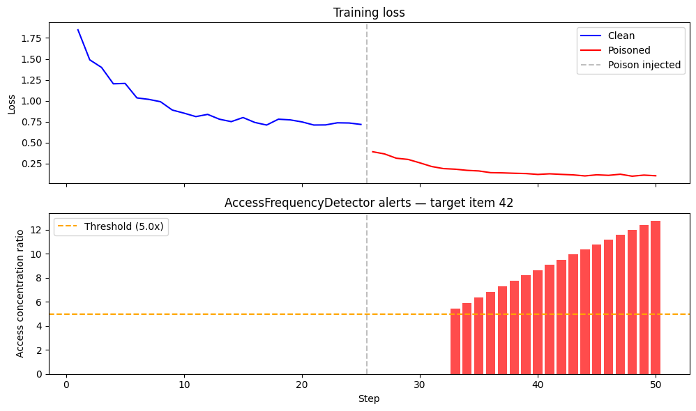

# EmbdGuard

Real-time embedding-level poisoning detection for TorchRec recommender systems. Attaches PyTorch hooks to `EmbeddingBagCollection` modules, captures per-step gradient and access statistics, and runs pluggable anomaly detectors during training.

## Setup

```bash
pip install torch torchrec numpy pandas scikit-learn pytest
```

## Usage

```python
from src.guard import EmbdGuard
from src.detectors.gradient_anomaly import GradientAnomalyDetector
from src.detectors.access_frequency import AccessFrequencyDetector

guard = EmbdGuard(model, log_path="embdguard_log.jsonl")
guard.add_detector(GradientAnomalyDetector(threshold_z=3.0, min_steps=20))
guard.add_detector(AccessFrequencyDetector(concentration_threshold=5.0, min_steps=10))

for batch in dataloader:
    loss = model(batch)
    optimizer.zero_grad()
    loss.backward()
    optimizer.step()
    alerts = guard.step()
    for alert in alerts:
        print(alert)

guard.detach()
```

## Detection results

`demo.py` trains a Two-Tower model on clean data for 25 steps, then injects poisoned batches where fake users all interact with a target item. EmbdGuard catches the attack:

```
── Phase 1: Clean training (25 steps) ──
  Step 1: loss=1.8463 — no alerts
  Step 11: loss=0.8115 — no alerts
  Step 21: loss=0.7112 — no alerts

── Phase 2: Poisoned training targeting item 42 ──
  Step 31: loss=0.2162 — no alerts
  [Step 33] WARNING: Row 42 accessed 5.5x above mean (count=11, mean=2.0)
  [Step 34] WARNING: Row 42 accessed 5.9x above mean (count=12, mean=2.0)
  [Step 36] WARNING: Row 42 accessed 6.8x above mean (count=14, mean=2.1)
  [Step 40] WARNING: Row 42 accessed 8.6x above mean (count=18, mean=2.1)
  [Step 45] WARNING: Row 42 accessed 10.8x above mean (count=23, mean=2.1)
  [Step 50] WARNING: Row 42 accessed 12.8x above mean (count=28, mean=2.2)
```

The `AccessFrequencyDetector` fires at step 33 when the target item's access count crosses 5x the mean — 8 steps after poisoning begins.



**Top**: training loss drops sharply once poisoned data is injected (step 26) — the model overfits to the fake interactions. **Bottom**: each red bar is an alert from the `AccessFrequencyDetector`. The concentration ratio (how many times more the target item is accessed vs the average item) starts at 5.5x and climbs to 12.8x, well above the 5.0x threshold (orange dashed line).

## Logging

With `log_path` set, EmbdGuard writes JSONL — one line per event:

```jsonl
{"type": "stats", "step": 1, "table": "t_user_id", "data": {"n_accessed": 116.0, "grad_norm": 0.0887, "grad_max": 0.0091}}
{"type": "stats", "step": 1, "table": "t_item_id", "data": {"n_accessed": 125.0, "grad_norm": 0.0952, "grad_max": 0.0110}}
{"type": "alert", "step": 33, "detector": "access_frequency", "severity": "warning", "table": "t_item_id", "message": "Row 42 accessed 5.5x above mean (count=11, mean=2.0)", "details": {"concentration_ratio": 5.46, "hottest_row": 42, "hottest_count": 11, "mean_count": 2.01}}
```

## Tests

```bash
pytest tests/ -v
```

## DLAttack pipeline

The `dlattack_research/` directory contains a full DLAttack replication (Huang et al., NDSS 2021) on MovieLens-1M with a TorchRec Two-Tower model:

```bash
cd dlattack_research
python main.py --phase all --epochs 30 --rounds 5
```

## Project structure

```
src/
  guard.py              EmbdGuard orchestrator
  hooks.py              EBC hook attachment + stat collection
  stats.py              StatAccumulator ring buffer
  alerts.py             Alert dataclass
  log.py                JSONL structured logger
  detectors/
    __init__.py          BaseDetector ABC
    gradient_anomaly.py  Z-score gradient spike detection
    access_frequency.py  Access concentration detection
    tia.py               Target Item Analysis detection
tests/
dlattack_research/
```
